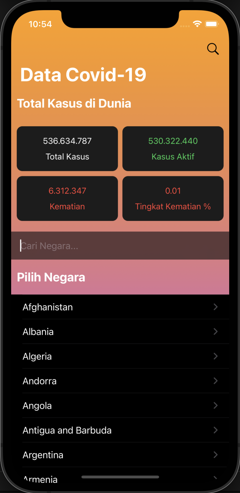
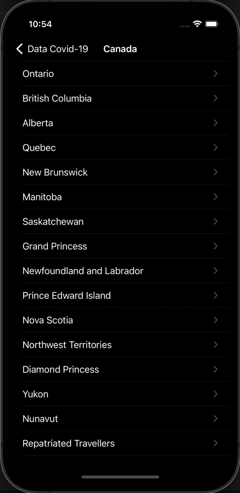
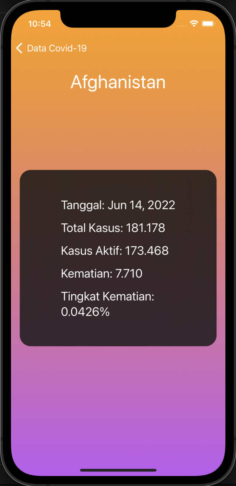

# CovStats
<p align="center">
  <a href="#" target="_blank"></a>
</p>

CovStats adalah aplikasi iOS Data Statistik Internasional Covid-19 yang datanya didapatkan dari [rapidapi.com](https://rapidapi.com/axisbits-axisbits-default/api/covid-19-statistics/) dengan struktur REST API. Dibuat menggunakan SwiftUI, MVVM Design Pattern, dan REST APIs dari rapidapi.com. Aplikasi ini memiliki fitur Storing Cache Locally, Search, Custom Alert, Responsive Layout Display, Number Formatting, dan Dark Mode Integration.

## Preview
<p align="center">
    <a href="#" target="_blank"></a>
    <a href="#" target="_blank"></a>
    <a href="#" target="_blank"></a>
</p>

<!-- ABOUT THE FILE & FOLDER STRUCTURE -->
## Folder & File Structure
CovStats mengikuti pedoman design pattern dengan 3 komponen, yaitu Model, View, & ViewModel (MVVM). 
Berikut struktur file dan folder pada CovStats:

    .
    ├── CovStatsApp.swift
    ├── ContentView.swift          # Berisikan Tampilan Halaman Beranda Aplikasi sebagai View Utama
    ├── Assets.xcassets            # Berisikan Default cardBackground dan App Icon
    │
    ├── API                        # API: API Service (Fetch Data Globally & Locally) dan Store & Save Countries Data Locally
    │   ├── LocalFileManager.swift # Berisikan Fungsi (Store & Save, Fetch from Saved, dan Helper) Data Countries
    │   └── CovStatsAPI.swift      # Berisikan Fungsi Decode JSON File, Fetch (data, response, & error) via URL Session dengan method GET, & Generate 
    │                                Hasil (Total Data, Negara, dan Report)
    │
    ├── Errors                     # Error: Custom Error dan Custom Alert ketika Gagal Fetch API dari Server
    │   ├── CustomError.swift      # Berisikan 2 Error Case untuk Incorrect URL dan No Data Received
    │   └── AlertItem.swift        # Berisikan Deklarasi Singleton Alert Item dan Macam-macam Alert Context
    │
    ├── Extension                  # Extension: Custom Extension untuk Format Penulisan Angka (Data Kasus)
    │   └── Extension+Int.swift    # Berisikan Custom Format Number Decimal & Format Pembulatan Digit Jutaan (ex. "5.1 Juta")
    │
    ├── Models                     # Models: API Data Declaration
    │   ├── Regions.swift          # Berisikan Endpoints Data Regions
    │   ├── Report.swift           # Berisikan Endpoints Data Report
    │   └── TotalData.swift        # Berisikan Endpoints Data TotalData
    │
    ├── ViewModels                          # ViewModel: Fungsi Information Handler (Data Bindings) yang Berkomunikasi Langsung dengan UI di Views
    │   ├── CountryDetailViewModel.swift    # Berisikan Fungsi Fetch Report berdasarkan Country (Kode iso)
    │   └── MainViewModel.swift             # Berisikan Fungsi Fetch Total Data dan Fetch All Countries
    │
    └── Views                           # Views: Controller UI & Frontend Related (Show & Get Data from ViewModels)
        ├── CountryDetailView.swift     # Berisikan Tampilan Halaman Provinsi ketika Salah Satu Negara dipilih (jika ada maka ditampilkan)
        ├── DataCardView.swift          # Berisikan Default Card Wrapper untuk Masing-masing Data (TotalDataView)
        ├── SearchBarView.swift         # Berisikan Bar Form untuk Kolom Search
        ├── TotalDataView.swift         # Berisikan Layout 4 DataCardView untuk Tampilan Masing-masing Data Kasus Covid-19
        └── ReportView.swift            # Berisikan Tampilan Halaman Report untuk Negara atau untuk Negara per-bagian Provinsi

<!-- List of Features -->
## Features:

* MVVM Design Pattern
* Search
* Storing Cache Locally
* Custom Alert
* Responsive Layout Display
* Number Formatting
* Dark Mode Integration

<!-- Used Tools -->
## Build With:

* [Swift](https://www.swift.org/documentation/)
* [SwiftUI](https://developer.apple.com/xcode/swiftui/)
* [Xcode](https://developer.apple.com/xcode/)
* [Rapid API](https://rapidapi.com/)

<!-- How to Install -->
## Installation
Untuk menggunakan repositori ini, ikutilah petunjuk penggunaan berikut dan pastikan git sudah terinstall pada komputer (semua perintah dilaksanakan pada `cmd.exe` atau `terminal`):

1. Lakukan download .zip atau `clone` repositori dengan cara:
```bash
git clone https://github.com/dekapd99/CovStats.git
```

2. Buka project di Xcode dan copy API Key dari [rapidapi.com](https://rapidapi.com/axisbits-axisbits-default/api/covid-19-statistics/) (Pastikan Anda sudah login)
3. Jika sudah, buka Project Navigation klik API > CovStatsAPI.swift, paste string pada variabel X-RapidAPI-Key (line 21) dengan API Key Anda.
```bash
"X-RapidAPI-Key": "copy & paste your api key here", // Replace API Key disini
```

4. Build & Run

<!-- What Kind of License? -->
## License
MIT License: Copyright (c) 2022 DK

<p align="right">(<a href="#top">back to top</a>)</p>
